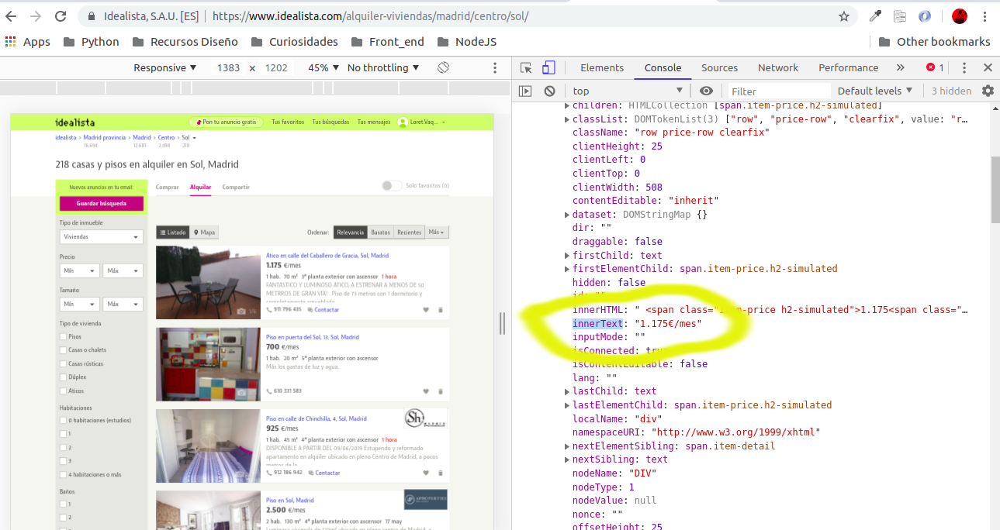

# EJEMPLO DE PRÁCTICA CON SELECTORES

El objetivo es hacer un pequeño análisis sobre una pequeña muestra de datos de precios de alquiler en una zona de Madrid. Para ello vamos a jugar un poco con los **"selectores"** en Javascript.

Lo único que vamos a necesitar es tener habilitadas las herramientas de desarrollador en tu navegador.

**¡¡ Al turrón !!**

## Procedimiento:
1. Seleccionar la zona que nos interesa: 

   En este caso vamos a "jugar" con la información relativa a la zona de Sol-Centro en la ciudad de Madrid. La url que vamos a usar (también puedes filtrar tu misma) sería:

   https://www.idealista.com/alquiler-viviendas/madrid/centro/sol/
 

2. Con la ayuda de los "selectores" encontramos y seleccionamos elementos del DOM que nos interesa para extraer información de cada nodo o manipularlos si así lo consideramos: 


*Para obtener rápidamente una referencia a un nodo DOM, hacemos clic con el botón derecho en el nodo DOM y seleccione Copy > Copy JS path. DevTools copia en el portapapeles una expresión document.querySelector () que apunta al nodo.*

```javascript
let container = document.querySelector("#main-content > section");
console.log(container);
```
2. Es conveniente que estudiemos que contiene este elemento, para ver que elementos nos interesan:


En este caso no interesa el precio y algunas características, como el número de habitaciones, m², etc.

Vamos a ver esto con calma:

Queremos crear un array que contenga los elementos de ```let container``` para poder interactuar con ellos:
```javascript
let resultados = [...container.querySelectorAll('article')];
```
*Usamos **spread operator** u Operador de Propagación para que nos devuelvan un array y no una NodeList*

Solo nos interesa cierta inforamción de las que está disponible, por lo que, "mapeamos" para que cada elemento contenga unicamenta la información que nos interesa:
```javascript
let resultados = [...container.querySelectorAll('article')].map(el => [...el.querySelectorAll('div.price-row, span.item-detail')]);
console.log(resultados)
```
3. Seleccionamos la propiedad de los elementos que nos son útiles:

```javascript
let analisis = [...resultados.map(el => el.map(subel => subel.innerText))];
console.log(analisis)
```



4. Los elementos del array son ```strings ```. Para poder interactuar con ellos debemos convertirlos en números.

```javascript
let seleccion = [...analisis.map(el => el.map(subel => parseInt(subel.replace(".", ""))))];
```
*Eliminamos los puntos de los strings que representan los separadores de miles:*

5. Eliminar los anuncios, es decir, los elementos del array vacíos:
```javascript
let seleccionSinPublic = seleccion.filter(el => el.length > 0);
```

6. Seleccionar las viviendas por el número de habitaciones (lo m² son un poco rollo)
```javascript
let seleccionPorHabitacion = seleccionSinPublic.filter(el => el[1] === 2);
```

7. Seleccionar los importes de alquiler:
```javascript
let seleccionPreciosAlquiler = seleccionPorHabitacion.map(el => el[0]);
```
8. Promedio alquiler en nuestra seleccion:

```javascript
let promedioAlquiler = (seleccionPreciosAlquiler.reduce((previous, current) => current += previous)) / seleccionPreciosAlquiler.length;
```


**Extra Extra**

Ya hemos visto como "trastear" un poquillo con el DOM, pero es posible que queramos traernos algunos datos a otro formato.
Con la instrucción ``` copy ``` podremos copiar nuestros datos al portapapeles:

```javascript
copy(analisis.filter(el => el.length > 0));
```

Vamos a ir un poquillo más allá y darle un poco de forma a estos datos:

```javascript
let test = analisis
    .filter(el => el.length > 0)
    .map(el => {
            Object.assign({}, el);
            return {
                Precio: el[0],
                Habitaciones: el[1],
                Metros: el[2],
                Planta: el[3],
            };
        });
console.log(test);
copy(test);
```

